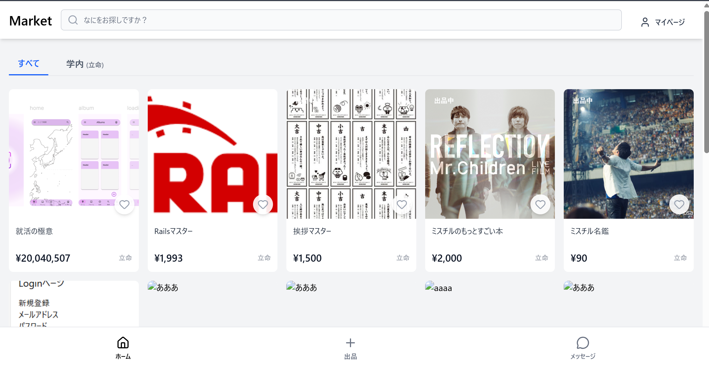

# 学生向けフリマアプリ

##URL
https://free-market-project.vercel.app/

##ハッカソンで作成、大学生が利用できるフリマアプリを目指して開発しました

##技術スタック
・フロントエンド 　：React,TypeScript,Vite,Tailwind
・バックエンド　 　：supabase
・デザイン 　　　　：Figma
・連絡ツール 　　　：Discord,Notion

##データベース、ルーティングの関係（後に変更されました）
https://docs.google.com/spreadsheets/d/1nlrevMWd1D48W4ZAkd9BV51HOXDSUNXL2tY_l5x6I-k/edit?usp=sharing

##私の主な担当
・ルーティング設定
・プロジェクトの進捗管理

・チャット機能開発
・アイテムカード作成
・アイテム詳細ページ開発
・マイページの出品一覧管理機能
・大学フィルタリング機能

##開発（ハッカソン）期間
###9/25~10/5(10/6 以降は個人で開発)
